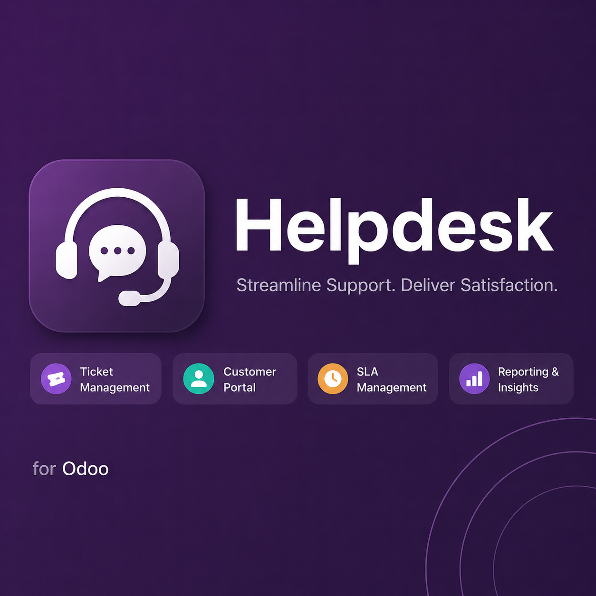
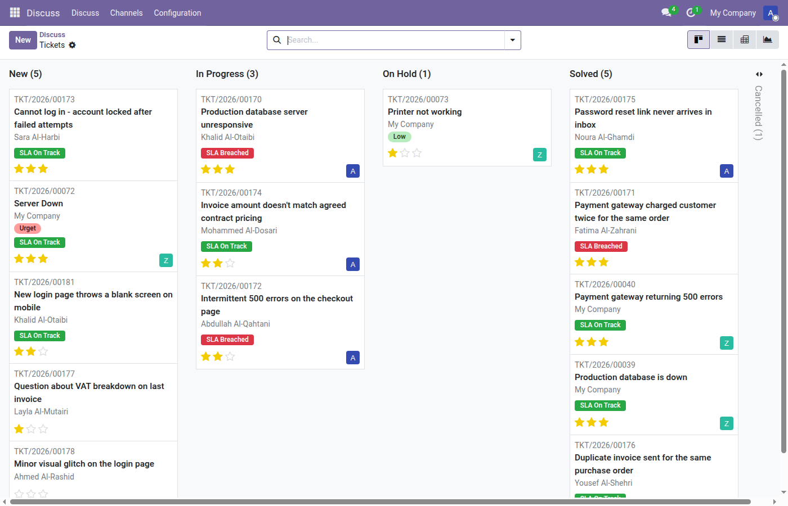
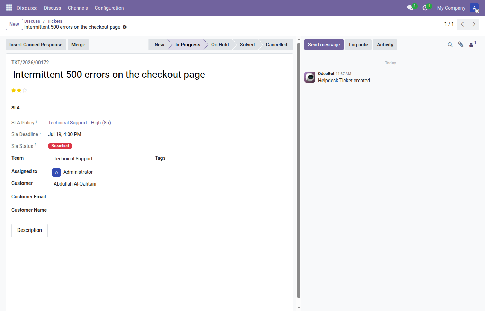
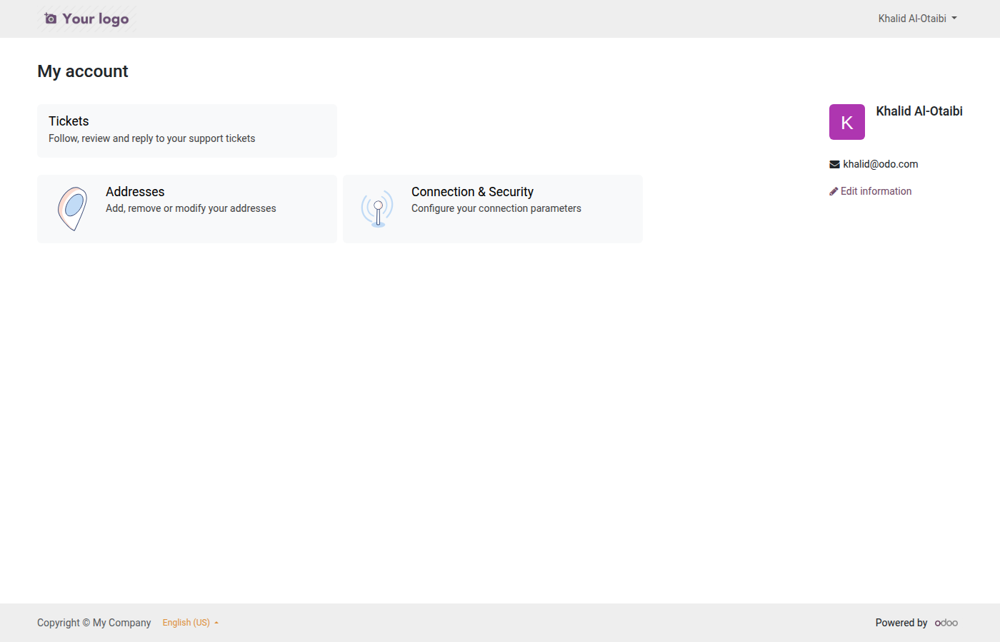
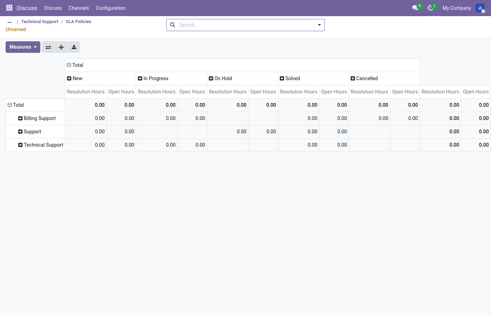

# Helpdesk Pro

[](https://github.com/Zahoor-ishfaq/odoo-helpdesk-pro/actions/workflows/ci.yml)
[](LICENSE)
[](https://www.odoo.com)
[](helpdesk_community_pro/i18n/ar.po)



A free, production-grade helpdesk module for Odoo Community: SLA
tracking, a customer portal, CSAT ratings, canned responses, ticket
merging, and team analytics — all built on core Odoo (`mail`, `portal`,
`resource`), no third-party dependencies.

Maintained for **Odoo 17.0** (`17.0` branch) and **Odoo 19.0** (`19.0`
branch) in parallel.

## Features

- **SLA policies** — target resolution hours matched to a ticket by
  team, priority, and tag, with a live On Track / At Risk / Breached
  badge computed against the team's real working calendar (nights and
  weekends don't count).
- **Customer portal** — customers see only their own tickets, enforced
  by record rules (not a filtered view), with full communication
  history.
- **CSAT ratings** — one-click Good / Okay / Bad rating links emailed
  automatically when a ticket closes, secured with a signed,
  single-use token.
- **Canned responses** — reusable reply snippets, optionally scoped to
  a team, inserted into a ticket in one click.
- **Ticket merging** — fold a duplicate ticket's messages, followers,
  and attachments into the ticket you're keeping.
- **Email-to-ticket** — a team's email alias turns incoming mail into
  tickets automatically; replies thread back into the ticket either
  way.
- **Analytics** — pivot/graph ticket analysis plus per-team SLA
  compliance and average resolution stat buttons.
- **Demo data & i18n** — realistic demo dataset installs with the
  module; Arabic (`ar`) translation included alongside the English
  source strings.

See the [user guide](helpdesk_community_pro/docs/user-guide.md) (also available
[in Arabic](helpdesk_community_pro/docs/user-guide-ar.md)) for a full walkthrough.

## Screenshots

<table>
<tr>
<td width="50%">

**Ticket kanban** — live SLA badges, per-team queues



</td>
<td width="50%">

**Ticket form** — matched SLA policy, deadline, and status



</td>
</tr>
<tr>
<td width="50%">

**Customer portal** — scoped to the logged-in customer's own tickets



</td>
<td width="50%">

**Ticket analysis** — pivot/graph, sliceable by team, stage, priority



</td>
</tr>
</table>

The full interface — including these same screens — is also available
in Arabic; see the `_ar` screenshots under
[`static/description/screenshots/`](helpdesk_community_pro/static/description/screenshots/)
or the [Arabic user guide](helpdesk_community_pro/docs/user-guide-ar.md).

## Install

1. Copy (or clone) the `helpdesk_community_pro/` folder into your Odoo addons
   path.
2. Restart Odoo and update the apps list.
3. Install **Helpdesk Pro** from Apps.

Requires only core Community apps as dependencies: `mail`, `portal`,
`resource`. No Enterprise features, no paid dependencies.

## Local development

Two independent Docker Compose stacks are provided, one per Odoo
series, each with its own Postgres volume and port:

```bash
docker compose -f docker-compose.yml up      # Odoo 17.0 → http://localhost:8069
docker compose -f docker-compose.19.yml up   # Odoo 19.0 → http://localhost:8079
```

Run the test suite inside a container:

```bash
docker compose run --rm web odoo -d test17 -i helpdesk_community_pro \
  --test-enable --test-tags /helpdesk_community_pro --stop-after-init
```

Lint before committing:

```bash
pre-commit run -a
```

## License

[LGPL-3](LICENSE)
