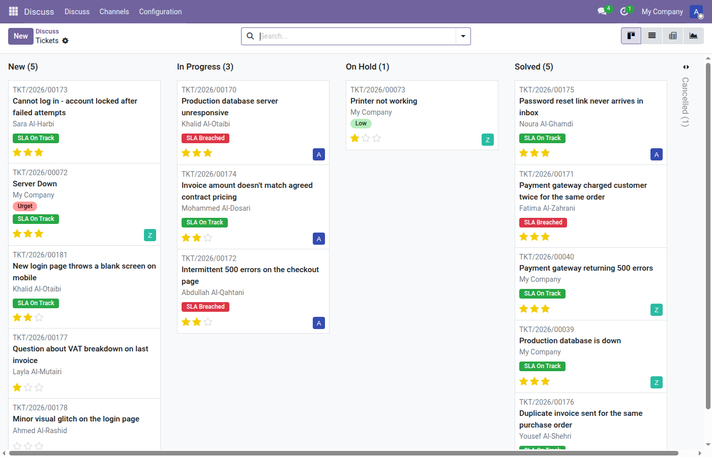
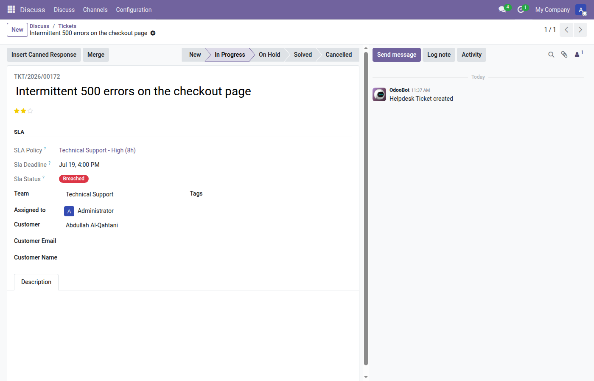
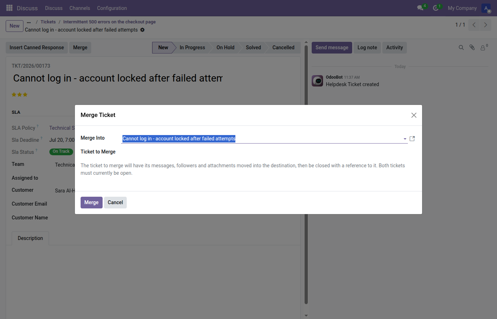
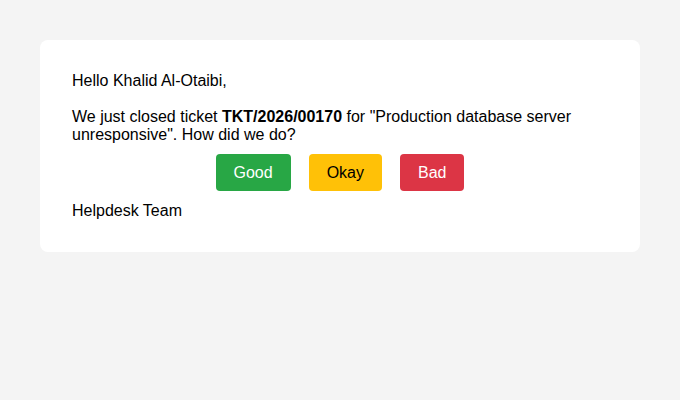
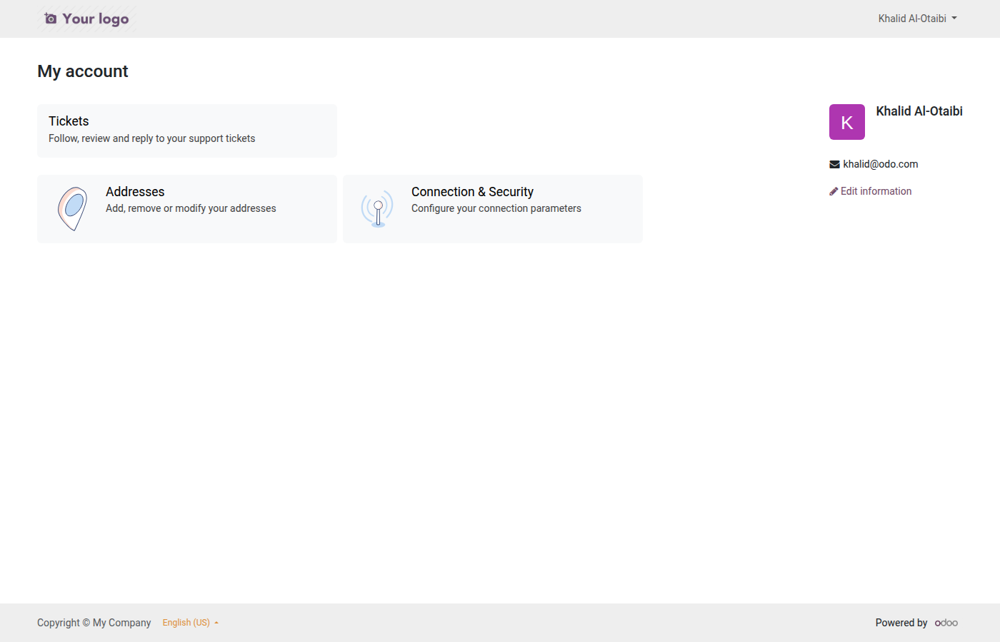

# Helpdesk Pro — User Guide

Helpdesk Pro adds a full support-ticket workflow to Odoo: SLA tracking, a
customer portal, CSAT ratings, canned responses, ticket merging, and
team analytics. This guide covers day-to-day use for agents, managers,
and customers.

## Contents

- [Concepts](#concepts)
- [Setting up a team](#setting-up-a-team)
- [Stages](#stages)
- [SLA policies](#sla-policies)
- [Working a ticket](#working-a-ticket)
- [Canned responses](#canned-responses)
- [Merging duplicate tickets](#merging-duplicate-tickets)
- [Customer satisfaction (CSAT) ratings](#customer-satisfaction-csat-ratings)
- [The customer portal](#the-customer-portal)
- [Analytics](#analytics)
- [Email-to-ticket](#email-to-ticket)
- [Permissions](#permissions)
- [FAQ](#faq)

## Concepts

| Term | Meaning |
|---|---|
| **Team** | A support queue (e.g. "Customer Support") with its own members, working calendar, and email alias. |
| **Stage** | A pipeline step a ticket moves through (New → In Progress → On Hold → Solved). Any stage can be marked as a *closing* stage. |
| **SLA Policy** | A target resolution time (in working hours) matched to a ticket by team, priority, and tag. |
| **Rating** | A customer satisfaction score (Good / Okay / Bad) collected after a ticket closes. |

## Setting up a team

1. Go to **Helpdesk ▸ Configuration ▸ Teams** and click **New**.
2. Set a **Name**, add **Team Members**, and choose a **Working Hours**
   calendar — this calendar is what SLA deadlines are calculated against
   (nights and weekends don't count against the clock).
3. Optionally set an **Email Alias** so incoming mail to that address
   creates a ticket automatically (see [Email-to-ticket](#email-to-ticket)).
4. Enable **CSAT** if you want a rating-request email sent automatically
   whenever a ticket from this team is closed.

## Stages

Go to **Helpdesk ▸ Configuration ▸ Stages** to manage the pipeline.

- **Per-team stages** — leave a stage's **Teams** field empty to share
  it with every team, or pick one or more teams to offer it only to
  them. Each team's pipeline is its own stages plus the shared ones,
  in **Sequence** order: a new ticket starts in its team's first stage,
  the kanban opened from a team shows only that team's columns, and the
  ticket form only lets you pick stages valid for the ticket's team.
  Moving a ticket to another team puts it in that team's first stage
  (keeping it open or closed where possible) if its current stage isn't
  available there.
- **Stage emails** — set an **Email Template** on a stage to email the
  customer whenever a ticket moves into it (for example "We're waiting
  on your reply"). The email is also posted to the ticket's chatter.
  Tickets created directly in that stage don't receive it, and neither
  does a ticket closed by a merge. If the stage is also a closing stage
  and the team has CSAT enabled, the customer receives the stage email
  first and the rating request second.
- **Reopening** — when a closed ticket moves back to an open stage (an
  agent drags it, or the customer replies), its close date is cleared
  and its SLA status is refreshed straight away. The SLA deadline still
  counts from when the ticket was created; reopening doesn't restart it.

## SLA policies

Go to **Helpdesk ▸ Configuration ▸ SLA Policies**. Each policy defines:

- **Team** — which team's tickets it applies to.
- **Priority** — leave empty to match any priority, or pick a specific one.
- **Tag** — leave empty to match any (or no) tags.
- **Target Hours** — working hours allowed from ticket creation to close.

When a ticket is created, the **most specific matching policy** (team +
priority + tag) is attached automatically, and a deadline is computed
using the team's working calendar. The ticket form and kanban card show
a live **SLA Status** badge:

- 🟢 **On Track** — plenty of time left.
- 🟠 **At Risk** — approaching the deadline.
- 🔴 **Breached** — deadline has passed.

Once a ticket reaches a closing stage, its SLA status and hours are
frozen — they won't keep changing after the fact.

## Working a ticket

Open **Helpdesk ▸ Tickets**. A ticket has:

- **Subject** and **Description** — what the customer reported.
- **Customer**, **Assigned to**, **Team**, **Priority**, **Tags**.
- **Stage** — drag the kanban card, or change the field on the form.
- An **SLA** panel (shown once a policy is matched) with the policy,
  deadline, and status badge.
- The standard Odoo chatter for replies, internal notes, and followers.

Replying in the chatter sends an email to the customer; the customer
can also reply directly from their own inbox, and their reply threads
back into the same ticket.

## Canned responses

Go to **Helpdesk ▸ Configuration ▸ Canned Responses** to create reusable
reply snippets (optionally scoped to a specific team, or left available
to everyone). From a ticket, use the **Insert Canned Response** button
to pick one, preview it, and drop it straight into your reply.

## Merging duplicate tickets

If a customer opens two tickets for the same issue, open the ticket you
want to **keep** and click **Merge**. Pick the other (duplicate) ticket
as the source. Helpdesk Pro moves its messages, followers, and
attachments into the destination ticket, then closes the duplicate with
a reference back to where it went. Both tickets must be open at the
time of the merge.

## Customer satisfaction (CSAT) ratings

If a team has **CSAT** enabled, closing one of its tickets sends the
customer an email with three links: **Good**, **Okay**, or **Bad**.
Clicking a link opens a short confirmation page; the rating is only
recorded once the customer presses **Submit** there, and a thank-you
page follows. The confirmation step stops email security scanners,
which open every link in a message, from recording a rating the
customer never gave. The links are signed per ticket: the customer can
come back and change their rating for 7 days after first rating, after
which it is locked. Ratings roll up into each team's **CSAT** score on
the Teams list and form.

## The customer portal

Customers with a portal account can see their own tickets under
**My Account ▸ Tickets** — reference, subject, and status, with a link
into each ticket's full communication history. They only ever see
their own tickets, enforced by record rules (not just a filtered
view), so this is safe even for tech-savvy users probing the URL.

## Analytics

**Helpdesk ▸ Tickets ▸ Ticket Analysis** opens a pivot/graph view for
slicing tickets by team, stage, priority, resolution hours, and open
hours. Each **Team** form also shows stat buttons for **SLA
Compliance** (% of closed tickets that met their deadline) and **Avg.
Resolution** (working hours from creation to close).

## Email-to-ticket

Set a team's **Email Alias** (e.g. `support`) and point your domain's
MX/catch-all at your Odoo mail gateway. Any email sent to
`support@yourdomain.com` becomes a new ticket on that team, with the
sender as the customer and the email body as the description. Replies
on either side (agent or customer) thread into the same ticket.

## Permissions

Two groups ship with the module:

- **User: Agent** — can see and work tickets for their teams, use
  canned responses, and merge tickets.
- **Manager** — full access to all teams, SLA policies, stages, tags,
  and canned responses, plus configuration menus.

Portal users (customers) are not part of either group — their access
is governed entirely by the portal record rules described above.

## FAQ

**Why doesn't a ticket show an SLA panel?**
No SLA policy matched its team/priority/tag combination. Add a policy
under **Configuration ▸ SLA Policies** — leave priority/tag empty for a
catch-all default.

**Can a customer see other customers' tickets?**
No. Portal access is scoped per-partner via record rules, not a
UI-level filter — there's no URL to bypass it.

**How is "resolution hours" calculated — does it count nights and
weekends?**
No. It's calendar-aware: it uses the team's **Working Hours** calendar,
so only working time counts toward SLA deadlines and resolution/open
hour statistics.
